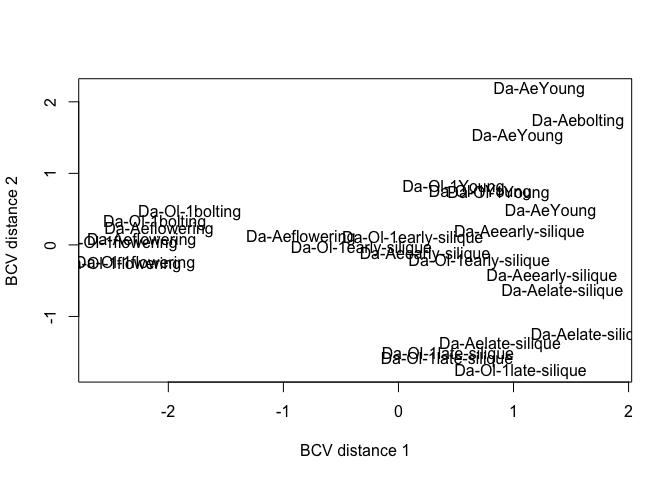
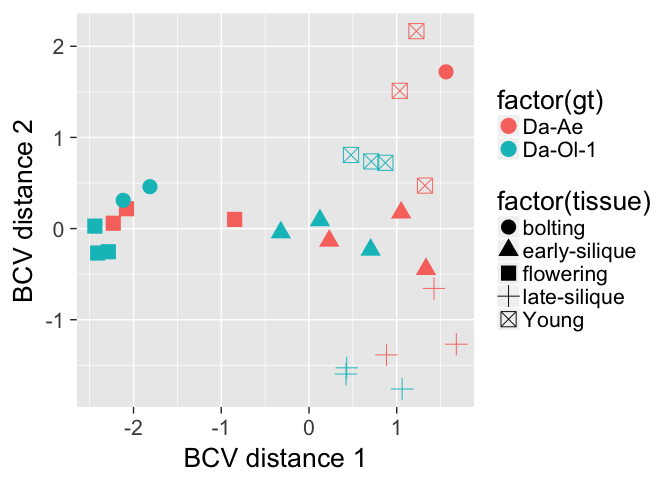
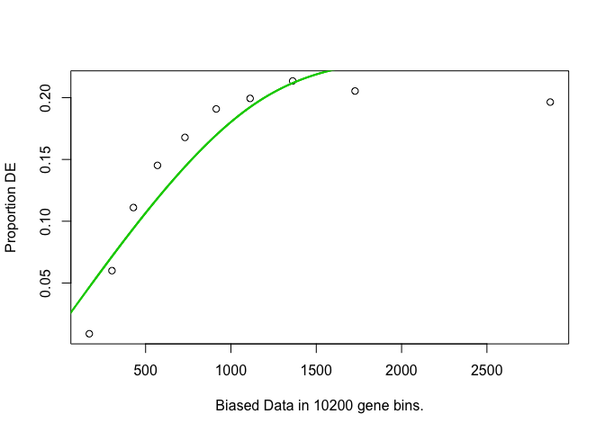
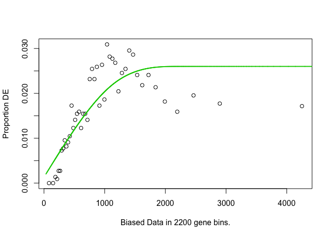
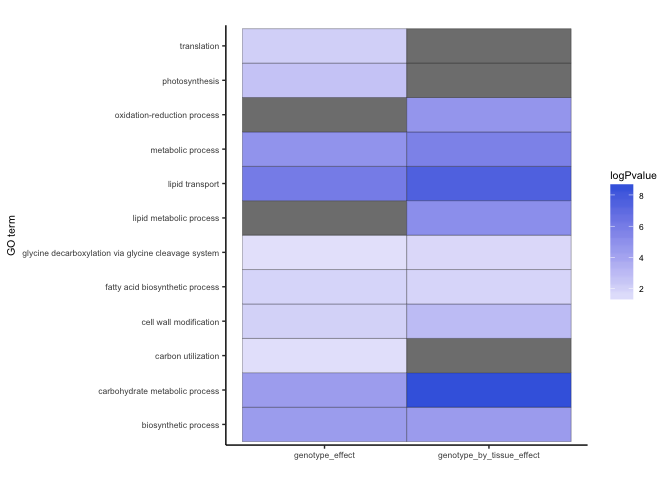

### read in data 

```r
setwd("~/Desktop/F2_paper/submission/Li-eQTL-TAG-2018/scripts/")
parent.read.count <- read.table("../input/read.count.tsv", header = T, check.names = F)
rownames(parent.read.count) <- parent.read.count[,1]
parent.read.count <- parent.read.count[,-1]  

# format data 
even_indexes<-seq(2,length(colnames(parent.read.count)),2)
parent.read.count.one <- parent.read.count[,even_indexes]
colnames(parent.read.count.one) <- sub("_2.fq","",colnames(parent.read.count.one),fixed = TRUE) 

# sample description  
sample_des <- read.csv("../input/parent_summary.csv")
sorted_sample_des <- sample_des[order(sample_des$SampleID),]
new_sample_ID <- paste(sorted_sample_des$Cultivar, sorted_sample_des$Stage, sorted_sample_des$rep, sep = "_")
colnames(parent.read.count.one) <- new_sample_ID 
```

### sample description & filtering 

```r
library(edgeR)
```

```
## Loading required package: limma
```

```r
library(ggplot2)
```

```
## Warning: package 'ggplot2' was built under R version 3.2.5
```

```r
parent.read.count.one <- parent.read.count.one[,colSums(parent.read.count.one) > 1000000]  
parent.read.count.one.sample<-data.frame(file=colnames(parent.read.count.one),
                             batch=factor(gsub("(Da-Ae|Da-Ol-1)(_)(Young|flowering|early-silique|late-silique|bolting)(_)(1|2|3)","\\5",colnames(parent.read.count.one))),  
                             genotype=factor(gsub("(Da-Ae|Da-Ol-1)(_)(Young|flowering|early-silique|late-silique|bolting)(_)(1|2|3)","\\1",colnames(parent.read.count.one))),	
                             stage=factor(gsub("(Da-Ae|Da-Ol-1)(_)(Young|flowering|early-silique|late-silique|bolting)(_)(1|2|3)","\\3",colnames(parent.read.count.one))),	
                             group=factor(gsub("(Da-Ae|Da-Ol-1)(_)([[:print:]]+)(_)(1|2|3)","\\1\\3",colnames(parent.read.count.one)))
)

# filter based on read count 
parent.read.count.one.small <- parent.read.count.one[rowSums(parent.read.count.one > 10) >= 3,]
```

### normalize & clustering  

```r
dge.new <- DGEList(counts=parent.read.count.one.small, group=parent.read.count.one.sample$group)
dge.new <- calcNormFactors(dge.new, method = "TMM") 
mds <- plotMDS(dge.new, method = "bcv",labels = dge.new$samples$group)
```

<!-- -->

```r
x <- as.data.frame(mds$x)
y <- as.data.frame(mds$y)
distance_matrix <- merge(x, y, by="row.names")
distance_matrix$group <- gsub("(Da-Ae|Da-Ol-1)(_)(Young|flowering|early-silique|late-silique|bolting)(_)(1|2|3)","\\1\\3",distance_matrix$Row.names)
distance_matrix$gt <- gsub("(Da-Ae|Da-Ol-1)(_)(Young|flowering|early-silique|late-silique|bolting)(_)(1|2|3)","\\1",distance_matrix$Row.names)
distance_matrix$tissue <- gsub("(Da-Ae|Da-Ol-1)(_)(Young|flowering|early-silique|late-silique|bolting)(_)(1|2|3)","\\3",distance_matrix$Row.names)

colnames(distance_matrix) <- c("lib","x","y","group","gt","tissue")

p.mds <- ggplot(data = distance_matrix) + theme_gray(base_size = 20) + 
  geom_point(aes(x, y, color=factor(gt), shape=factor(tissue)), size=5) + 
  labs(y = "BCV distance 2", x="BCV distance 1") + 
  theme()

p.mds
```

<!-- -->

### design matrix and expression analysis 

```r
parent.read.count.one.sample$genotype <- as.factor(parent.read.count.one.sample$genotype)
parent.read.count.one.sample$tissue <- as.factor(parent.read.count.one.sample$stage)
parent.read.count.one.sample$genotype <- relevel(parent.read.count.one.sample$genotype,ref="Da-Ol-1")
parent.read.count.one.sample$tissue <- relevel(parent.read.count.one.sample$tissue,ref="Young")

design.new <- model.matrix(~tissue*genotype,data = parent.read.count.one.sample) 

# calculate dispersion
dge.new <- estimateGLMCommonDisp(dge.new, design.new,verbose = TRUE) 
```

```
## Disp = 0.25646 , BCV = 0.5064
```

```r
dge.new <- estimateGLMTrendedDisp(dge.new,design.new)
dge.new <- estimateGLMTagwiseDisp(dge.new,design.new)

fit.new <- glmFit(dge.new, design.new)
lrt.new.interaction <- glmLRT(fit.new,coef = c("tissuebolting:genotypeDa-Ae", "tissueearly-silique:genotypeDa-Ae", "tissueflowering:genotypeDa-Ae", "tissuelate-silique:genotypeDa-Ae"))

DEgene.new.interaction <- topTags(lrt.new.interaction,n = Inf)$table[topTags(lrt.new.interaction,n = Inf)$table$FDR<0.05,]
nrow(DEgene.new.interaction)  
```

```
## [1] 1701
```

```r
# genes for gt 
lrt.new.gt <- glmLRT(fit.new,coef = c("genotypeDa-Ae", "tissuebolting:genotypeDa-Ae", "tissueearly-silique:genotypeDa-Ae", "tissueflowering:genotypeDa-Ae", "tissuelate-silique:genotypeDa-Ae"))
DEgene.new.gt <- topTags(lrt.new.gt,n = Inf)$table[topTags(lrt.new.gt,n = Inf)$table$FDR<0.05,]
nrow(DEgene.new.gt)  
```

```
## [1] 15098
```

### GO enrichment analysis 

```r
source("helper.R") 
```

```
## Loading required package: BiocGenerics
```

```
## Loading required package: parallel
```

```
## 
## Attaching package: 'BiocGenerics'
```

```
## The following objects are masked from 'package:parallel':
## 
##     clusterApply, clusterApplyLB, clusterCall, clusterEvalQ,
##     clusterExport, clusterMap, parApply, parCapply, parLapply,
##     parLapplyLB, parRapply, parSapply, parSapplyLB
```

```
## The following object is masked from 'package:limma':
## 
##     plotMA
```

```
## The following objects are masked from 'package:stats':
## 
##     IQR, mad, xtabs
```

```
## The following objects are masked from 'package:base':
## 
##     anyDuplicated, append, as.data.frame, as.vector, cbind,
##     colnames, do.call, duplicated, eval, evalq, Filter, Find, get,
##     grep, grepl, intersect, is.unsorted, lapply, lengths, Map,
##     mapply, match, mget, order, paste, pmax, pmax.int, pmin,
##     pmin.int, Position, rank, rbind, Reduce, rownames, sapply,
##     setdiff, sort, table, tapply, union, unique, unlist, unsplit
```

```
## Loading required package: BiocParallel
```

```
## Loading required package: Biostrings
```

```
## Loading required package: S4Vectors
```

```
## Loading required package: stats4
```

```
## Loading required package: IRanges
```

```
## Loading required package: XVector
```

```
## Loading required package: Rsamtools
```

```
## Loading required package: GenomeInfoDb
```

```
## Loading required package: GenomicRanges
```

```
## Loading required package: GenomicAlignments
```

```
## Loading required package: SummarizedExperiment
```

```
## Loading required package: Biobase
```

```
## Welcome to Bioconductor
## 
##     Vignettes contain introductory material; view with
##     'browseVignettes()'. To cite Bioconductor, see
##     'citation("Biobase")', and for packages 'citation("pkgname")'.
```

```
## Loading required package: BiasedUrn
```

```
## Loading required package: geneLenDataBase
```

```
## 
```

```
## Loading required package: AnnotationDbi
```

```
## Loading required package: XML
```

```
## Loading required package: dynamicTreeCut
```

```
## Loading required package: fastcluster
```

```
## Warning: package 'fastcluster' was built under R version 3.2.5
```

```
## 
## Attaching package: 'fastcluster'
```

```
## The following object is masked from 'package:stats':
## 
##     hclust
```

```
## ==========================================================================
## *
## *  Package WGCNA 1.63 loaded.
## *
## *    Important note: It appears that your system supports multi-threading,
## *    but it is not enabled within WGCNA in R. 
## *    To allow multi-threading within WGCNA with all available cores, use 
## *
## *          allowWGCNAThreads()
## *
## *    within R. Use disableWGCNAThreads() to disable threading if necessary.
## *    Alternatively, set the following environment variable on your system:
## *
## *          ALLOW_WGCNA_THREADS=<number_of_processors>
## *
## *    for example 
## *
## *          ALLOW_WGCNA_THREADS=4
## *
## *    To set the environment variable in linux bash shell, type 
## *
## *           export ALLOW_WGCNA_THREADS=4
## *
## *     before running R. Other operating systems or shells will
## *     have a similar command to achieve the same aim.
## *
## ==========================================================================
```

```
## 
## Attaching package: 'WGCNA'
```

```
## The following object is masked from 'package:IRanges':
## 
##     cor
```

```
## The following object is masked from 'package:stats':
## 
##     cor
```

```
## Warning: package 'reshape2' was built under R version 3.2.5
```

```
## Warning: package 'scales' was built under R version 3.2.5
```

```
## Warning: package 'plyr' was built under R version 3.2.5
```

```
## 
## Attaching package: 'plyr'
```

```
## The following object is masked from 'package:ShortRead':
## 
##     id
```

```
## The following object is masked from 'package:XVector':
## 
##     compact
```

```
## The following object is masked from 'package:IRanges':
## 
##     desc
```

```
## The following object is masked from 'package:S4Vectors':
## 
##     rename
```

```r
# gt effect  
DEgene.GO.ORA.gt <- GOseq.Bn.ORA(rownames(DEgene.new.gt))
```

```
## Warning in pcls(G): initial point very close to some inequality constraints
```

```
## Using manually entered categories.
```

```
## Calculating the p-values...
```

```
## 'select()' returned 1:1 mapping between keys and columns
```

<!-- -->

```
## [1] "enriched.GO is"
##        category over_represented_pvalue under_represented_pvalue
## 784  GO:0006869            1.436084e-09                1.0000000
## 850  GO:0008152            4.718542e-08                1.0000000
## 969  GO:0009058            1.943609e-07                1.0000000
## 564  GO:0005975            2.654896e-07                1.0000000
## 1124 GO:0015979            2.102840e-05                0.9999903
## 650  GO:0006412            8.197560e-05                0.9999408
## 1448 GO:0042545            1.308954e-04                0.9999289
## 734  GO:0006633            1.839404e-04                0.9998973
## 1122 GO:0015976            6.070890e-04                0.9998665
## 1276 GO:0019464            7.634876e-04                0.9999242
##      numDEInCat numInCat
## 784          28       77
## 850         505     2196
## 969         135      475
## 564         356     1504
## 1124         50      207
## 650         202     1344
## 1448         66      223
## 734          67      248
## 1122         12       27
## 1276          6       12
##                                                     term ontology
## 784                                      lipid transport       BP
## 850                                    metabolic process       BP
## 969                                 biosynthetic process       BP
## 564                       carbohydrate metabolic process       BP
## 1124                                      photosynthesis       BP
## 650                                          translation       BP
## 1448                              cell wall modification       BP
## 734                      fatty acid biosynthetic process       BP
## 1122                                  carbon utilization       BP
## 1276 glycine decarboxylation via glycine cleavage system       BP
##      over_represented_padjust
## 784              9.291462e-07
## 850              1.526448e-05
## 969              4.191718e-05
## 564              4.294294e-05
## 1124             2.721074e-03
## 650              8.839702e-03
## 1448             1.209847e-02
## 734              1.487618e-02
## 1122             4.364295e-02
## 1276             4.939765e-02
```

```r
DEgene.GO.ORA.interaction <- GOseq.Bn.ORA(rownames(DEgene.new.interaction))
```

```
## Warning in pcls(G): initial point very close to some inequality constraints
```

```
## Using manually entered categories.
```

```
## Calculating the p-values...
```

```
## 'select()' returned 1:1 mapping between keys and columns
```

<!-- -->

```
## [1] "enriched.GO is"
##        category over_represented_pvalue under_represented_pvalue
## 564  GO:0005975            4.288713e-12                1.0000000
## 784  GO:0006869            8.117981e-11                1.0000000
## 850  GO:0008152            8.719237e-09                1.0000000
## 732  GO:0006629            5.341913e-08                1.0000000
## 1632 GO:0055114            1.593691e-07                1.0000000
## 969  GO:0009058            3.726231e-07                0.9999999
## 1448 GO:0042545            1.280937e-05                0.9999967
## 734  GO:0006633            1.983937e-04                0.9999418
## 1276 GO:0019464            3.211886e-04                0.9999916
##      numDEInCat numInCat
## 564          77     1504
## 784          12       77
## 850          89     2196
## 732          40      705
## 1632        127     3869
## 969          30      475
## 1448         17      223
## 734          15      248
## 1276          3       12
##                                                     term ontology
## 564                       carbohydrate metabolic process       BP
## 784                                      lipid transport       BP
## 850                                    metabolic process       BP
## 732                              lipid metabolic process       BP
## 1632                         oxidation-reduction process       BP
## 969                                 biosynthetic process       BP
## 1448                              cell wall modification       BP
## 734                      fatty acid biosynthetic process       BP
## 1276 glycine decarboxylation via glycine cleavage system       BP
##      over_represented_padjust
## 564              2.774798e-09
## 784              2.626167e-08
## 850              1.880449e-06
## 732              8.640545e-06
## 1632             2.062236e-05
## 969              4.018119e-05
## 1448             1.183952e-03
## 734              1.604509e-02
## 1276             2.308989e-02
```

```r
# draw heatmap for gt & gt:tissue effect genes 
gt <- DEgene.GO.ORA.gt[,c("Term", "over_represented_padjust")] 
gt.tissue <- DEgene.GO.ORA.interaction[,c("Term", "over_represented_padjust")]
gt_gt.tissue <- merge(gt, gt.tissue, by="Term", all=TRUE)
names(gt_gt.tissue)[c(2:3)] <- c("genotype_effect", "genotype_by_tissue_effect")
gt_gt.tissue.melt <- melt(gt_gt.tissue)
```

```
## Using Term as id variables
```

```r
gt_gt.tissue.melt$logPvalue <- -log10(gt_gt.tissue.melt$value)

# plot 
pl.heatmap1 <- ggplot(data = gt_gt.tissue.melt) + 
  geom_tile(color = "black", aes(x = factor(variable), y = Term, fill=logPvalue)) + scale_fill_gradient2(low=muted("green"), high=("royalblue")) + 
  labs(y = "GO term", x="", title=" ") + 
  theme_classic() + 
  theme(text = element_text(size=8), axis.text=element_text(size=rel(0.8))) 

pl.heatmap1    
```

<!-- -->

