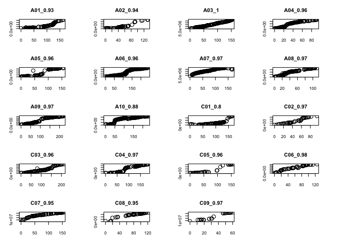

load libraries

```r
library(tidyverse)
```

```
## ── Attaching packages ────────────────────────────────── tidyverse 1.2.1 ──
```

```
## ✔ ggplot2 2.2.1     ✔ purrr   0.2.4
## ✔ tibble  1.4.2     ✔ dplyr   0.7.4
## ✔ tidyr   0.8.0     ✔ stringr 1.3.0
## ✔ readr   1.1.1     ✔ forcats 0.3.0
```

```
## Warning: package 'ggplot2' was built under R version 3.2.5
```

```
## Warning: package 'readr' was built under R version 3.2.5
```

```
## Warning: package 'purrr' was built under R version 3.2.5
```

```
## Warning: package 'dplyr' was built under R version 3.2.5
```

```
## ── Conflicts ───────────────────────────────────── tidyverse_conflicts() ──
## ✖ dplyr::filter() masks stats::filter()
## ✖ dplyr::lag()    masks stats::lag()
```

```r
library(qtl)
```

```
## Warning: package 'qtl' was built under R version 3.2.5
```

replace markers with double crossover (indication of mis-genotyping) with missing data, and remove markers with too many missgenotyping 

```r
## all markers on A & C 
LG.f2.madmapper <- read.cross("mm", file = "~/Desktop/Brassica_project/KIAT_RNA_seq/F2/output/F2_geno_for_one_map_final.txt", mapfile = "~/Desktop/Brassica_project/KIAT_RNA_seq/F2/output/LG.f2.madmapper.C05C08.map") 
```

```
##  --Read the following data:
## 	Type of cross:          f2 
## 	Number of individuals:  166 
## 	Number of markers:      3443 
## 	Number of phenotypes:   0 
##  --Cross type: f2
```

```r
summary(LG.f2.madmapper) # 2029  
```

```
##     F2 intercross
## 
##     No. individuals:    166 
## 
##     No. phenotypes:     1 
##     Percent phenotyped: 100 
## 
##     No. chromosomes:    19 
##         Autosomes:      1 2 3 4 5 6 7 8 9 10 11 12 13 14 15 16 17 18 19 
## 
##     Total markers:      2029 
##     No. markers:        116 52 157 108 97 251 156 110 201 163 88 48 120 103 
##                         37 60 89 47 26 
##     Percent genotyped:  95.3 
##     Genotypes (%):      AA:22.5  AB:53.4  BB:24.2  not BB:0.0  not AA:0.0
```

```r
# iterate over all LGs 
# rename to the right name 
names(LG.f2.madmapper$geno)[1:10] <- paste("A", c("01", "02", "03", "04", "05", "06", "07", "08", "09", "10"), sep = "")
names(LG.f2.madmapper$geno)[11:19] <- paste("C", c("01", "02", "03", "04", "05", "06", "07", "08", "09"), sep = "") 

# remove double crossover 
summaryMap(LG.f2.madmapper) # 6835
```

```
##         n.mar length ave.spacing max.spacing
## A01       116  365.2         3.2        17.1
## A02        52  247.2         4.8        18.9
## A03       157  409.3         2.6        16.2
## A04       108  294.0         2.7        21.9
## A05        97  385.4         4.0        32.1
## A06       251  706.9         2.8        22.9
## A07       156  433.1         2.8        16.9
## A08       110  305.9         2.8        14.2
## A09       201  623.3         3.1        31.4
## A10       163  479.0         3.0        26.1
## C01        88  321.1         3.7        11.9
## C02        48  176.2         3.7        14.8
## C03       120  439.2         3.7        14.6
## C04       103  426.2         4.2        20.4
## C05        37  250.4         7.0        27.7
## C06        60  261.2         4.4        21.8
## C07        89  346.7         3.9        14.9
## C08        47  245.9         5.3        23.6
## C09        26  119.9         4.8        16.5
## overall  2029 6835.8         3.4        32.1
```

```r
LG.f2.madmapper.before.crossover <- LG.f2.madmapper 

for (chr in names(LG.f2.madmapper$geno)) { # for each chromosome in cross genotype data
  my.chr <- get(chr,LG.f2.madmapper$geno) # return the genotype data, including data & map
  print(paste(chr,"NA before",sum(is.na(my.chr$data)))) 
  if(ncol(my.chr$data) > 3) { 
    my.chr$data[,2:(ncol(my.chr$data)-1)] <- sapply(2:(ncol(my.chr$data)-1),function(i) {
      apply(my.chr$data[,(i-1):(i+1)],1,function(gt) {
        if (any(is.na(gt))) return(gt[2]) #technically should be looking at the next genotyped marker.
        if ( (length(unique(gt)) == 2) & (gt[1] == gt[3])) return(NA)
        if ( length(unique(gt))  == 3) return(NA)
        return(gt[2])
      })
    })
  }
  LG.f2.madmapper$geno <- within(LG.f2.madmapper$geno,assign(chr,my.chr))
  print(paste(chr,"NA after",sum(is.na(get(chr,LG.f2.madmapper$geno)$data))))
}  
```

```
## [1] "A01 NA before 969"
## [1] "A01 NA after 1270"
## [1] "A02 NA before 425"
## [1] "A02 NA after 617"
## [1] "A03 NA before 1095"
## [1] "A03 NA after 1452"
## [1] "A04 NA before 841"
## [1] "A04 NA after 1092"
## [1] "A05 NA before 823"
## [1] "A05 NA after 1109"
## [1] "A06 NA before 1849"
## [1] "A06 NA after 2487"
## [1] "A07 NA before 1210"
## [1] "A07 NA after 1600"
## [1] "A08 NA before 827"
## [1] "A08 NA after 1095"
## [1] "A09 NA before 1527"
## [1] "A09 NA after 2046"
## [1] "A10 NA before 1283"
## [1] "A10 NA after 1686"
## [1] "C01 NA before 724"
## [1] "C01 NA after 957"
## [1] "C02 NA before 325"
## [1] "C02 NA after 452"
## [1] "C03 NA before 952"
## [1] "C03 NA after 1309"
## [1] "C04 NA before 785"
## [1] "C04 NA after 1160"
## [1] "C05 NA before 319"
## [1] "C05 NA after 460"
## [1] "C06 NA before 463"
## [1] "C06 NA after 679"
## [1] "C07 NA before 740"
## [1] "C07 NA after 1033"
## [1] "C08 NA before 378"
## [1] "C08 NA after 558"
## [1] "C09 NA before 140"
## [1] "C09 NA after 235"
```

```r
# restimate map with double crossover removed 
f2.map.new <- est.map(LG.f2.madmapper,verbose=T,error.prob=.01)  
```

```
## Chr A01:
##   no. iterations = 82
##   max rel've change at last step = 0.0000002
##   loglik: -2747.7593
## 
## Chr A02:
##   no. iterations = 26
##   max rel've change at last step = 0.0000004
##   loglik: -1770.7581
## 
## Chr A03:
##   no. iterations = 215
##   max rel've change at last step = 0.0000010
##   loglik: -3187.1563
## 
## Chr A04:
##   no. iterations = 503
##   max rel've change at last step = 0.0000010
##   loglik: -2220.3971
## 
## Chr A05:
##   no. iterations = 82
##   max rel've change at last step = 0.0000005
##   loglik: -2596.0353
## 
## Chr A06:
##   no. iterations = 1715
##   max rel've change at last step = 0.0000010
##   loglik: -5075.7142
## 
## Chr A07:
##   no. iterations = 254
##   max rel've change at last step = 0.0000010
##   loglik: -3201.7753
## 
## Chr A08:
##   no. iterations = 244
##   max rel've change at last step = 0.0000010
##   loglik: -2346.0530
## 
## Chr A09:
##   no. iterations = 124
##   max rel've change at last step = 0.0000008
##   loglik: -4373.5346
## 
## Chr A10:
##   no. iterations = 124
##   max rel've change at last step = 0.0000006
##   loglik: -3388.3381
## 
## Chr C01:
##   no. iterations = 56
##   max rel've change at last step = 0.0000010
##   loglik: -2605.4470
## 
## Chr C02:
##   no. iterations = 17
##   max rel've change at last step = 0.0000007
##   loglik: -1531.4745
## 
## Chr C03:
##   no. iterations = 81
##   max rel've change at last step = 0.0000001
##   loglik: -3299.9394
## 
## Chr C04:
##   no. iterations = 703
##   max rel've change at last step = 0.0000010
##   loglik: -2819.3286
## 
## Chr C05:
##   no. iterations = 17
##   max rel've change at last step = 0.0000005
##   loglik: -1817.1336
## 
## Chr C06:
##   no. iterations = 42
##   max rel've change at last step = 0.0000000
##   loglik: -1855.9697
## 
## Chr C07:
##   no. iterations = 126
##   max rel've change at last step = 0.0000010
##   loglik: -2546.6388
## 
## Chr C08:
##   no. iterations = 238
##   max rel've change at last step = 0.0000010
##   loglik: -1706.2259
## 
## Chr C09:
##   no. iterations = 102
##   max rel've change at last step = 0.0000003
##   loglik:  -926.8318
```

```r
LG.f2.madmapper <- replace.map(LG.f2.madmapper, f2.map.new)
LG.f2.madmapper.after.crossover <- LG.f2.madmapper

summaryMap(LG.f2.madmapper.after.crossover) 
```

```
##         n.mar length ave.spacing max.spacing
## A01       116  163.9         1.4        12.6
## A02        52  132.5         2.6        19.2
## A03       157  154.1         1.0         9.4
## A04       108  112.7         1.1        21.2
## A05        97  191.6         2.0        35.7
## A06       251  240.2         1.0         7.4
## A07       156  167.3         1.1        12.5
## A08       110  110.9         1.0        12.1
## A09       201  259.7         1.3        39.2
## A10       163  196.6         1.2        26.9
## C01        88  165.1         1.9        12.8
## C02        48   94.7         2.0        13.1
## C03       120  210.0         1.8         9.7
## C04       103  182.2         1.8        13.7
## C05        37  176.1         4.9        29.5
## C06        60  125.1         2.1        12.2
## C07        89  153.9         1.7         9.6
## C08        47  135.6         2.9        22.3
## C09        26   59.7         2.4        13.0
## overall  2029 3032.0         1.5        39.2
```

```r
# plot.rf(LG.f2.madmapper.after.crossover, col.scheme = "redblue", alternate.chrid = T) 

### deal with A10 
plot.rf(LG.f2.madmapper.after.crossover, chr = "A10")  
```

```
## Warning in plot.rf(LG.f2.madmapper.after.crossover, chr = "A10"): Running
## est.rf.
```

<!-- -->

```r
plotMap(LG.f2.madmapper.after.crossover, chr = 'A10') 
```

<!-- -->

```r
set.seed(16)
LG.f2.madmapper.after.crossover <- orderMarkers(LG.f2.madmapper.after.crossover, chr = "A10", 
	                        window = 5, use.ripple = TRUE, maxit = 4000, 
	                        error.prob = 0.0001, verbose = T)

plotMap(LG.f2.madmapper.after.crossover, chr = 'A10') 
```

<!-- -->

```r
plot.rf(LG.f2.madmapper.after.crossover, chr = 'A10') 
```

```
## Warning in plot.rf(LG.f2.madmapper.after.crossover, chr = "A10"): Running
## est.rf.
```

<!-- -->

```r
summaryMap(LG.f2.madmapper.after.crossover) 
```

```
##         n.mar length ave.spacing max.spacing
## A01       116  163.9         1.4        12.6
## A02        52  132.5         2.6        19.2
## A03       157  154.1         1.0         9.4
## A04       108  112.7         1.1        21.2
## A05        97  191.6         2.0        35.7
## A06       251  240.2         1.0         7.4
## A07       156  167.3         1.1        12.5
## A08       110  110.9         1.0        12.1
## A09       201  259.7         1.3        39.2
## A10       163  227.6         1.4        14.2
## C01        88  165.1         1.9        12.8
## C02        48   94.7         2.0        13.1
## C03       120  210.0         1.8         9.7
## C04       103  182.2         1.8        13.7
## C05        37  176.1         4.9        29.5
## C06        60  125.1         2.1        12.2
## C07        89  153.9         1.7         9.6
## C08        47  135.6         2.9        22.3
## C09        26   59.7         2.4        13.0
## overall  2029 3063.1         1.5        39.2
```

check segregation distortion and genetic VS physical colinearity, remove markers at the end of LG with big gaps, and showing segregation distortion, also seem to be misplaced based on genetic VS physical map colinearity  


```r
gt <- geno.table(LG.f2.madmapper.after.crossover)

# remove markers with a lot of missing data, these missing data are from double crossover, means mis-genotyping   
mar2drop <- rownames(gt[ gt$missing > 27,]) 
length(mar2drop)
```

```
## [1] 20
```

```r
LG.f2.madmapper.after.crossover.2 <- drop.markers(LG.f2.madmapper.after.crossover, mar2drop)
summaryMap(LG.f2.madmapper.after.crossover.2) # 2009 
```

```
##         n.mar length ave.spacing max.spacing
## A01       116  163.9         1.4        12.6
## A02        51  132.5         2.7        19.2
## A03       156  154.1         1.0         9.4
## A04       108  112.7         1.1        21.2
## A05        96  191.6         2.0        35.7
## A06       249  240.2         1.0         7.4
## A07       155  167.3         1.1        12.5
## A08       110  110.9         1.0        12.1
## A09       199  259.7         1.3        39.2
## A10       163  227.6         1.4        14.2
## C01        88  165.1         1.9        12.8
## C02        48   94.7         2.0        13.1
## C03       120  210.0         1.8         9.7
## C04        98  182.2         1.9        14.1
## C05        35  176.1         5.2        29.5
## C06        58  125.1         2.2        17.8
## C07        87  153.9         1.8         9.6
## C08        46  135.6         3.0        22.3
## C09        26   59.7         2.4        13.0
## overall  2009 3063.1         1.5        39.2
```

```r
markers_large_gap_end <- c("chrA04_6268533", "chrA05_21794646", "chrA09_30078310", "chrC05_40797215", "chrC06_35741582", "chrC08_34141406") 
plotMap(LG.f2.madmapper.after.crossover.2)
```

<!-- -->

```r
# segregation distortion 
mar_seg_dis <- rownames(gt[ gt$P.value < 1e-2,]) # there are quite several markers showing segregation distortion
mar2drop <- markers_large_gap_end[markers_large_gap_end %in% mar_seg_dis]
mar2drop
```

```
## [1] "chrA04_6268533"  "chrA05_21794646" "chrA09_30078310" "chrC05_40797215"
## [5] "chrC08_34141406"
```

```r
LG.f2.madmapper.after.crossover.2 <- drop.markers(LG.f2.madmapper.after.crossover, mar2drop)
summaryMap(LG.f2.madmapper.after.crossover.2) # 2929.9 
```

```
##         n.mar length ave.spacing max.spacing
## A01       116  163.9         1.4        12.6
## A02        52  132.5         2.6        19.2
## A03       157  154.1         1.0         9.4
## A04       107   91.4         0.9         6.3
## A05        96  155.8         1.6        14.4
## A06       251  240.2         1.0         7.4
## A07       156  167.3         1.1        12.5
## A08       110  110.9         1.0        12.1
## A09       200  220.5         1.1        10.5
## A10       163  227.6         1.4        14.2
## C01        88  165.1         1.9        12.8
## C02        48   94.7         2.0        13.1
## C03       120  210.0         1.8         9.7
## C04       103  182.2         1.8        13.7
## C05        36  154.2         4.4        29.5
## C06        60  125.1         2.1        12.2
## C07        89  153.9         1.7         9.6
## C08        46  120.6         2.7        22.3
## C09        26   59.7         2.4        13.0
## overall  2024 2929.9         1.5        29.5
```

```r
# check total rf graph 
# plot.rf(LG.f2.madmapper.after.crossover.2, col.scheme = "redblue", alternate.chrid = T) 
```

### flip order for several LGs

```r
LG.f2.madmapper.after.crossover <- LG.f2.madmapper.after.crossover.2
summaryMap(LG.f2.madmapper.after.crossover) # 2929 cM, 2024 markers 
```

```
##         n.mar length ave.spacing max.spacing
## A01       116  163.9         1.4        12.6
## A02        52  132.5         2.6        19.2
## A03       157  154.1         1.0         9.4
## A04       107   91.4         0.9         6.3
## A05        96  155.8         1.6        14.4
## A06       251  240.2         1.0         7.4
## A07       156  167.3         1.1        12.5
## A08       110  110.9         1.0        12.1
## A09       200  220.5         1.1        10.5
## A10       163  227.6         1.4        14.2
## C01        88  165.1         1.9        12.8
## C02        48   94.7         2.0        13.1
## C03       120  210.0         1.8         9.7
## C04       103  182.2         1.8        13.7
## C05        36  154.2         4.4        29.5
## C06        60  125.1         2.1        12.2
## C07        89  153.9         1.7         9.6
## C08        46  120.6         2.7        22.3
## C09        26   59.7         2.4        13.0
## overall  2024 2929.9         1.5        29.5
```

```r
LG.f2.madmapper.after.crossover <- flip.order(LG.f2.madmapper.after.crossover, chr = "A02")
LG.f2.madmapper.after.crossover <- flip.order(LG.f2.madmapper.after.crossover, chr = "A03")
LG.f2.madmapper.after.crossover <- flip.order(LG.f2.madmapper.after.crossover, chr = "A04")
LG.f2.madmapper.after.crossover <- flip.order(LG.f2.madmapper.after.crossover, chr = "A06")
LG.f2.madmapper.after.crossover <- flip.order(LG.f2.madmapper.after.crossover, chr = "A08")
LG.f2.madmapper.after.crossover <- flip.order(LG.f2.madmapper.after.crossover, chr = "A09")
LG.f2.madmapper.after.crossover <- flip.order(LG.f2.madmapper.after.crossover, chr = "C01")
LG.f2.madmapper.after.crossover <- flip.order(LG.f2.madmapper.after.crossover, chr = "C03")

# three markers are not on their physical chromosome, take them out from the genetic map, this might be caused by mis-mapping
markers_miss_mapping <- c("chrA05_20283387", "chrA04_10350184", "chrA09_9478710") 
LG.f2.madmapper.after.crossover <- drop.markers(LG.f2.madmapper.after.crossover, markers_miss_mapping)
summaryMap(LG.f2.madmapper.after.crossover) # 2021 2929.9 
```

```
##         n.mar length ave.spacing max.spacing
## A01       116  163.9         1.4        12.6
## A02        52  132.5         2.6        19.2
## A03       157  154.1         1.0         9.4
## A04       107   91.4         0.9         6.3
## A05        96  155.8         1.6        14.4
## A06       251  240.2         1.0         7.4
## A07       156  167.3         1.1        12.5
## A08       110  110.9         1.0        12.1
## A09       198  220.5         1.1        10.5
## A10       163  227.6         1.4        14.2
## C01        88  165.1         1.9        12.8
## C02        47   94.7         2.1        13.1
## C03       120  210.0         1.8         9.7
## C04       103  182.2         1.8        13.7
## C05        36  154.2         4.4        29.5
## C06        60  125.1         2.1        12.2
## C07        89  153.9         1.7         9.6
## C08        46  120.6         2.7        22.3
## C09        26   59.7         2.4        13.0
## overall  2021 2929.9         1.5        29.5
```

```r
### write out gen file 
write.cross(LG.f2.madmapper.after.crossover, format = "csvsr", filestem = "~/Desktop/F2_paper/submission/Li-eQTL-TAG-2018/output/LG.f2.madmapper.final.flipped_gen_C05C08.csv")
```

### make plot 

```r
map_geno <- read.csv("~/Desktop/F2_paper/submission/Li-eQTL-TAG-2018/output/LG.f2.madmapper.final.flipped_gen_C05C08.csv_gen.csv") 

map_geno <-
map_geno %>% 
  dplyr::select(id, X, X.1)  

map_geno$genetic_chr <- map_geno$X
map_geno$genetic_pos <- map_geno$X.1
map_geno$physical_chr <- gsub("(chr)([[:print:]]+)(_)([[:print:]]+)", "\\2", map_geno$id)
map_geno$genetic_chr <- factor(map_geno$X, levels = c("C09", "C08", "C07", "C06", "C05", "C04", "C03", "C02", "C01", "A10", "A09", "A08", "A07", "A06", "A05", "A04", "A03", "A02", "A01"))
map_geno$physical_pos <- gsub("(chr)([[:print:]]+)(_)([[:print:]]+)", "\\4", map_geno$id)
 
par(mfrow=c(5,4), mai = c(0.4, 0.4, 0.4, 0.4), ps = 8, cex = 1, cex.main = 1, cex.axis = 0.8, tcl = -0.3)  

for (i in unique(map_geno$genetic_chr)){
  plot(map_geno[map_geno$genetic_chr == i,]$genetic_pos, map_geno[map_geno$genetic_chr == i,]$physical_pos, 
       xlab = "genetic pos", ylab = "physical pos", main = i, type = "p", mgp=c(.1,.5,.0)) 
}

# genetic map plot 
par(mfrow=c(1,1))
```

<!-- -->

```r
plot.map(LG.f2.madmapper.after.crossover, alternate.chrid = T, main = "") # genetic map comparison
```

<!-- -->

```r
# summary map 
map_summary <- summaryMap(LG.f2.madmapper.after.crossover) 
write.csv(map_summary, file = "~/Desktop/F2_paper/submission/Li-eQTL-TAG-2018/output/map_summary.csv")   
```
