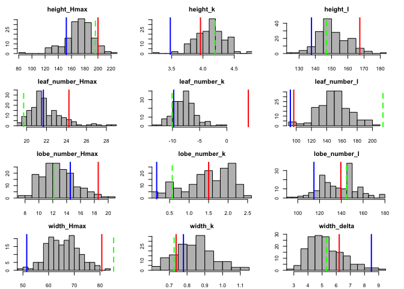
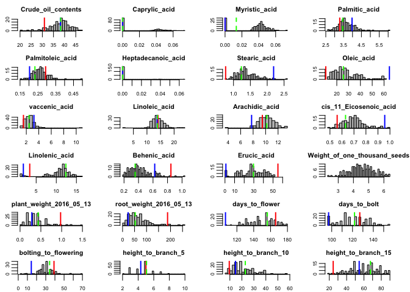
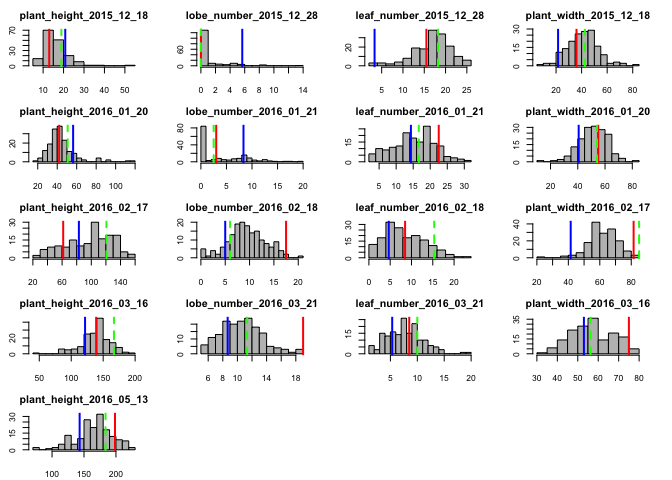
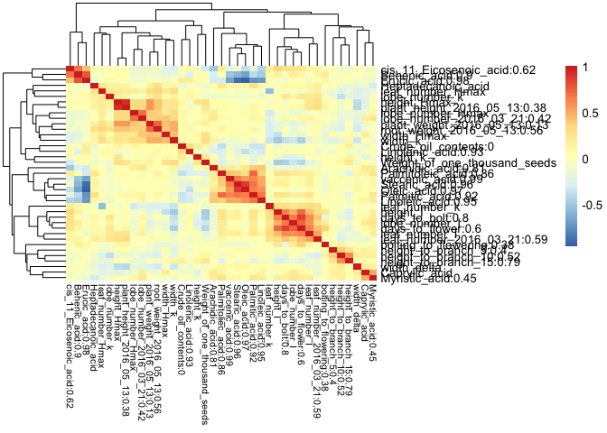

### load libs

```r
setwd("~/Desktop/F2_paper/submission/Li-eQTL-2018/scripts/")
library(tidyverse) 
```

```
## ── Attaching packages ────────────────────────────────── tidyverse 1.2.1 ──
```

```
## ✔ ggplot2 2.2.1     ✔ purrr   0.2.4
## ✔ tibble  1.4.2     ✔ dplyr   0.7.4
## ✔ tidyr   0.8.0     ✔ stringr 1.3.0
## ✔ readr   1.1.1     ✔ forcats 0.3.0
```

```
## Warning: package 'ggplot2' was built under R version 3.2.5
```

```
## Warning: package 'readr' was built under R version 3.2.5
```

```
## Warning: package 'purrr' was built under R version 3.2.5
```

```
## Warning: package 'dplyr' was built under R version 3.2.5
```

```
## ── Conflicts ───────────────────────────────────── tidyverse_conflicts() ──
## ✖ dplyr::filter() masks stats::filter()
## ✖ dplyr::lag()    masks stats::lag()
```

```r
library(ggplot2) 
library(reshape2) 
```

```
## Warning: package 'reshape2' was built under R version 3.2.5
```

```
## 
## Attaching package: 'reshape2'
```

```
## The following object is masked from 'package:tidyr':
## 
##     smiths
```

```r
library(lubridate)
```

```
## 
## Attaching package: 'lubridate'
```

```
## The following object is masked from 'package:base':
## 
##     date
```

```r
library(devtools)
library(pheatmap)
library(RColorBrewer)
library(cowplot) 
```

```
## Warning: package 'cowplot' was built under R version 3.2.5
```

```
## Warning: `legend.margin` must be specified using `margin()`. For the old
## behavior use legend.spacing
```

```
## 
## Attaching package: 'cowplot'
```

```
## The following object is masked from 'package:ggplot2':
## 
##     ggsave
```

```r
library(lme4) 
```

```
## Loading required package: Matrix
```

```
## Warning: package 'Matrix' was built under R version 3.2.5
```

```
## 
## Attaching package: 'Matrix'
```

```
## The following object is masked from 'package:tidyr':
## 
##     expand
```

```r
library(lmerTest)
```

```
## Warning: package 'lmerTest' was built under R version 3.2.5
```

```
## 
## Attaching package: 'lmerTest'
```

```
## The following object is masked from 'package:lme4':
## 
##     lmer
```

```
## The following object is masked from 'package:stats':
## 
##     step
```

```r
library(WGCNA)
```

```
## Loading required package: dynamicTreeCut
```

```
## Loading required package: fastcluster
```

```
## Warning: package 'fastcluster' was built under R version 3.2.5
```

```
## 
## Attaching package: 'fastcluster'
```

```
## The following object is masked from 'package:stats':
## 
##     hclust
```

```
## 
```

```
## ==========================================================================
## *
## *  Package WGCNA 1.63 loaded.
## *
## *    Important note: It appears that your system supports multi-threading,
## *    but it is not enabled within WGCNA in R. 
## *    To allow multi-threading within WGCNA with all available cores, use 
## *
## *          allowWGCNAThreads()
## *
## *    within R. Use disableWGCNAThreads() to disable threading if necessary.
## *    Alternatively, set the following environment variable on your system:
## *
## *          ALLOW_WGCNA_THREADS=<number_of_processors>
## *
## *    for example 
## *
## *          ALLOW_WGCNA_THREADS=4
## *
## *    To set the environment variable in linux bash shell, type 
## *
## *           export ALLOW_WGCNA_THREADS=4
## *
## *     before running R. Other operating systems or shells will
## *     have a similar command to achieve the same aim.
## *
## ==========================================================================
```

```
## 
## Attaching package: 'WGCNA'
```

```
## The following object is masked from 'package:stats':
## 
##     cor
```

```r
source("helper.R") 
```

```
## Loading required package: BiocGenerics
```

```
## Loading required package: parallel
```

```
## 
## Attaching package: 'BiocGenerics'
```

```
## The following objects are masked from 'package:parallel':
## 
##     clusterApply, clusterApplyLB, clusterCall, clusterEvalQ,
##     clusterExport, clusterMap, parApply, parCapply, parLapply,
##     parLapplyLB, parRapply, parSapply, parSapplyLB
```

```
## The following object is masked from 'package:Matrix':
## 
##     as.vector
```

```
## The following objects are masked from 'package:lubridate':
## 
##     intersect, setdiff, union
```

```
## The following objects are masked from 'package:dplyr':
## 
##     combine, intersect, setdiff, union
```

```
## The following objects are masked from 'package:stats':
## 
##     IQR, mad, xtabs
```

```
## The following objects are masked from 'package:base':
## 
##     anyDuplicated, append, as.data.frame, as.vector, cbind,
##     colnames, do.call, duplicated, eval, evalq, Filter, Find, get,
##     grep, grepl, intersect, is.unsorted, lapply, lengths, Map,
##     mapply, match, mget, order, paste, pmax, pmax.int, pmin,
##     pmin.int, Position, rank, rbind, Reduce, rownames, sapply,
##     setdiff, sort, table, tapply, union, unique, unlist, unsplit
```

```
## Loading required package: BiocParallel
```

```
## Loading required package: Biostrings
```

```
## Loading required package: S4Vectors
```

```
## Loading required package: stats4
```

```
## 
## Attaching package: 'S4Vectors'
```

```
## The following object is masked from 'package:dplyr':
## 
##     rename
```

```
## Loading required package: IRanges
```

```
## 
## Attaching package: 'IRanges'
```

```
## The following object is masked from 'package:Matrix':
## 
##     expand
```

```
## The following object is masked from 'package:lubridate':
## 
##     %within%
```

```
## The following objects are masked from 'package:dplyr':
## 
##     collapse, desc, slice
```

```
## The following objects are masked from 'package:purrr':
## 
##     reduce, simplify
```

```
## The following object is masked from 'package:tidyr':
## 
##     expand
```

```
## Loading required package: XVector
```

```
## 
## Attaching package: 'XVector'
```

```
## The following object is masked from 'package:purrr':
## 
##     compact
```

```
## Loading required package: Rsamtools
```

```
## Loading required package: GenomeInfoDb
```

```
## Loading required package: GenomicRanges
```

```
## Loading required package: GenomicAlignments
```

```
## Loading required package: SummarizedExperiment
```

```
## Loading required package: Biobase
```

```
## Welcome to Bioconductor
## 
##     Vignettes contain introductory material; view with
##     'browseVignettes()'. To cite Bioconductor, see
##     'citation("Biobase")', and for packages 'citation("pkgname")'.
```

```
## 
## Attaching package: 'GenomicAlignments'
```

```
## The following objects are masked from 'package:dplyr':
## 
##     first, last
```

```
## 
## Attaching package: 'ShortRead'
```

```
## The following object is masked from 'package:dplyr':
## 
##     id
```

```
## The following object is masked from 'package:purrr':
## 
##     compose
```

```
## Loading required package: BiasedUrn
```

```
## Loading required package: geneLenDataBase
```

```
## Loading required package: AnnotationDbi
```

```
## 
## Attaching package: 'AnnotationDbi'
```

```
## The following object is masked from 'package:dplyr':
## 
##     select
```

```
## Loading required package: XML
```

```
## Warning: package 'scales' was built under R version 3.2.5
```

```
## 
## Attaching package: 'scales'
```

```
## The following object is masked from 'package:purrr':
## 
##     discard
```

```
## The following object is masked from 'package:readr':
## 
##     col_factor
```

```
## Warning: package 'plyr' was built under R version 3.2.5
```

```
## -------------------------------------------------------------------------
```

```
## You have loaded plyr after dplyr - this is likely to cause problems.
## If you need functions from both plyr and dplyr, please load plyr first, then dplyr:
## library(plyr); library(dplyr)
```

```
## -------------------------------------------------------------------------
```

```
## 
## Attaching package: 'plyr'
```

```
## The following object is masked from 'package:ShortRead':
## 
##     id
```

```
## The following object is masked from 'package:XVector':
## 
##     compact
```

```
## The following object is masked from 'package:IRanges':
## 
##     desc
```

```
## The following object is masked from 'package:S4Vectors':
## 
##     rename
```

```
## The following object is masked from 'package:lubridate':
## 
##     here
```

```
## The following objects are masked from 'package:dplyr':
## 
##     arrange, count, desc, failwith, id, mutate, rename, summarise,
##     summarize
```

```
## The following object is masked from 'package:purrr':
## 
##     compact
```

### load data and formatting, histogram  

* growth model data 

```r
width <- read.csv("../input/width.added(indentical).best.fitted.summary.csv")
lobe_number <- read.csv("../input/lobe.n.added(identical).best.fitted.summary.csv")
height <- read.csv("../input/height.added(identical).best.fitted.summary.csv") 
leaf_number <- read.csv("../input/leaf.n.added(identical).best.fitted.summary.csv") 
height %>% dim() # 516 11 
```

```
## [1] 516  11
```

```r
height[,1:2] %>% head() 
```

```
##                       X        mean
## 1      b_Hmax_Intercept 171.7891898
## 2         b_k_Intercept   4.1100305
## 3         b_I_Intercept 150.8471288
## 4      b_Hmin_Intercept  18.4222671
## 5 sd_ID__Hmax_Intercept  23.1408316
## 6    sd_ID__k_Intercept   0.5337947
```

```r
ID <- gsub("(r_ID__I)(\\[)([[:print:]]+)(,Intercept])", "\\3", height$X)[347:515] 

height <- coef_extract(height, ID = ID)  
lobe_number <- coef_extract(lobe_number, ID = ID)
leaf_number <- coef_extract(leaf_number, ID = ID)
width <- coef_extract_width(width, ID = ID)  

colnames(height)[2:4] <- paste("height", colnames(height)[2:4], sep = "_")
colnames(lobe_number)[2:4] <- paste("lobe_number", colnames(lobe_number)[2:4], sep = "_")
colnames(leaf_number)[2:4] <- paste("leaf_number", colnames(leaf_number)[2:4], sep = "_")
colnames(width)[2:4] <- paste("width", colnames(width)[2:4], sep = "_")

height_parent <- height[c(1:3),]
lobe_number_parent <- lobe_number[c(1:3),]
leaf_number_parent <- leaf_number[c(1:3),] 
width_parent <- width[c(1:3),]

height <- height[c(4:nrow(height)),]
lobe_number <- lobe_number[c(4:nrow(lobe_number)),]
leaf_number <- leaf_number[c(4:nrow(leaf_number)),] 
width <- width[c(4:nrow(width)),]

growth_model_trait <- 
height %>% 
  left_join(leaf_number) %>% 
  left_join(lobe_number) %>% 
  left_join(width) 
```

```
## Joining, by = "line_ID"
## Joining, by = "line_ID"
## Joining, by = "line_ID"
```

```r
parent_model <- 
height_parent %>% 
  left_join(lobe_number_parent) %>%
  left_join(leaf_number_parent) %>%
  left_join(width_parent) 
```

```
## Joining, by = "line_ID"
## Joining, by = "line_ID"
## Joining, by = "line_ID"
```

```r
parent_model %>% dim() # 3 13
```

```
## [1]  3 13
```

```r
test.melt <- parent_model %>% melt()
```

```
## Using line_ID as id variables
```

```r
test.melt %>% head()
```

```
##   line_ID    variable      value
## 1   Da_Ae height_Hmax 200.097890
## 2  Da_Ol1 height_Hmax 152.127817
## 3      F1 height_Hmax 196.146267
## 4   Da_Ae    height_k   3.960429
## 5  Da_Ol1    height_k   3.477842
## 6      F1    height_k   4.194294
```

```r
growth_model_trait %>% dim() # 166 13
```

```
## [1] 166  13
```

```r
growth_model_trait$id <- gsub("ID", "Sample_F2", growth_model_trait$line_ID) 
growth_model_trait <- growth_model_trait[,-1] 
# save(growth_model_trait, file = "~/Desktop/F2_paper/data/growth_model_trait.Rdata")

setEPS() 
# postscript(file = "../output/model.eps", width=5.7, height=6.9)
par(mfrow=c(4,3), mai = c(0.3, 0.3, 0.3, 0.3), ps = 8, cex = 1, cex.main = 1, cex.axis = 0.8, tcl = -0.3)

for (i in colnames(growth_model_trait)[1:12]) { 
  hist(growth_model_trait[,i], breaks = 15, col = "grey", border = "black", xlab = "", ylab = "", main = i, xlim = c(min(growth_model_trait[,i], test.melt[(test.melt$variable == i),]$value), max(growth_model_trait[,i], test.melt[(test.melt$variable == i),]$value)), mgp=c(.1,.5,.0)) 
  abline(v = test.melt[(test.melt$variable == i & test.melt$line_ID == "Da_Ae"),]$value, col = "red", lwd = 2)
  abline(v = test.melt[(test.melt$variable == i & test.melt$line_ID == "Da_Ol1"),]$value, col = "blue", lwd = 2) 
  abline(v = test.melt[(test.melt$variable == i & test.melt$line_ID == "F1"),]$value, col = "green", lty = 2, lwd = 2)  
  } 
```

<!-- -->

* other traits data 

```r
phefile = read.csv("../input/F2.pheno.csv", stringsAsFactors = F, row.names = 1, header = F) 
phefile %>% dim() # 44 166 
```

```
## [1]  44 166
```

```r
phefile <- as.data.frame(t(phefile))   

rname <- phefile$id %>% as.character() 

phefile <- 
phefile %>% 
  dplyr::select(-Weight_of_survey, -Number_of_survey_seeds, -No__of_Transplanting_plants, -No__of_Survival_plant, -id)   

phefile <- sapply(colnames(phefile), function(trait) as.numeric(as.character(phefile[,trait])))
phefile <- as.data.frame(phefile)
rownames(phefile) <- rname

### add branch data into phefile 
extra <- read.csv("../input/AdditionalF2Data_updated_20180222.csv")
extra_F2 <- 
extra %>% 
  filter(Name == "F2")  

extra_F2$Individual_.No. <- gsub("138-", "Sample_F2_", extra_F2$Individual_.No.)

phefile$ID <- rownames(phefile) 

phefile <- 
phefile %>% 
  left_join(extra_F2, c("ID" = "Individual_.No.")) %>% 
  mutate(length_of_branch_5 = X5_length_of_branch,
         length_of_branch_10 = X10_length_of_branch,
         length_of_branch_15 = X15_length_of_branch,
         id = ID) %>% 
  dplyr::select(-(Name:X15_length_of_branch), -ID) 

# save(phefile, file = "~/Desktop/F2_paper/data/phefile.Rdata")

### add flowering time data 
library(lubridate) 
flowering_data <- read.csv("../input/flowering_data.csv")
colnames(flowering_data)[c(5,6)] <- c("bolting_date", "flowering_date")

flowering_data <- 
flowering_data %>%  
  filter(Name == "Da-Ol1" | Name == "Da-Ae" | Name == "F1") %>% 
  group_by(Name) %>%
  dplyr::summarise(days_to_bolt = mean(ymd(bolting_date)-ymd(Day_of_sowing), na.rm = T), 
            days_to_flower = mean(ymd(flowering_date)-ymd(Day_of_sowing), na.rm=T),
            bolting_to_flowering = mean(ymd(flowering_date)-ymd(bolting_date), na.rm=T))  
```

```
## Warning in as.POSIXlt.POSIXct(x, tz): unknown timezone 'zone/tz/2018e.1.0/
## zoneinfo/America/Los_Angeles'
```

```r
extra_1 <- 
extra %>% 
  filter(Name == "Da-Ol1" | Name == "Da-Ae" | Name == "F1") %>% 
  group_by(Name) %>% 
  dplyr::summarise(plant_weight_2016_05_13 = mean(Plant_weight_2016_05_13, na.rm = T), 
            root_weight_2016_05_13 = mean(Root_weight_2016_05_13, na.rm = T),
            length_of_branch_5 = mean(X5_length_of_branch, na.rm = T), 
            length_of_branch_10 = mean(X10_length_of_branch, na.rm = T),
            length_of_branch_15 = mean(X15_length_of_branch, na.rm = T)) 

extra_2 <- 
flowering_data %>% melt() %>%
  rbind(melt(extra_1)) %>%
  mutate(value = as.numeric(value))
```

```
## Using Name as id variables
## Using Name as id variables
```

```r
colnames(extra_2) <- c("variable", "PHENOTYPE", "mean")
extra_2$variable <- gsub("Da-Ol1", "Da-Ol-1", extra_2$variable) 

# add oil data from parents 
# oil trait 
pheno.parent.oil <- read.csv("../input/FA_parents_F1_20180416.csv", header = T, as.is = T, skip = 1)
pheno.parent.oil <- pheno.parent.oil[,-1] 

colnames(pheno.parent.oil) <- gsub("([[:print:]]+)(C)([[:print:]]+)", "\\1", colnames(pheno.parent.oil))
colnames(pheno.parent.oil) <- gsub("\\.$", "", colnames(pheno.parent.oil))
colnames(pheno.parent.oil) <- gsub("\\.$", "", colnames(pheno.parent.oil))
colnames(pheno.parent.oil) <- gsub("\\.$", "", colnames(pheno.parent.oil))
colnames(pheno.parent.oil) <- gsub("\\.", "\\_", colnames(pheno.parent.oil))  
colnames(pheno.parent.oil)[1] <- "Name" 
pheno.parent.oil$Name[1:6] <- gsub("(Da-Ae|Da-Ol1)([[:print:]]+)", "\\1", pheno.parent.oil$Name[1:6])
pheno.parent.oil$Name[7:9] <- "F1"  
pheno.parent.oil$cis_11_Eicosenoic_acid[2] <- NA
pheno.parent.oil$cis_11_Eicosenoic_acid[3] <- NA
pheno.parent.oil$Arachidic_acid[2] <- NA

pheno.parent.oil <- 
pheno.parent.oil %>% 
  filter(Name == "Da-Ol1" | Name == "Da-Ae" | Name == "F1") %>% 
  melt() %>% 
  group_by(Name, variable) %>% 
  dplyr::summarise(value = mean(value, na.rm = T))
```

```
## Using Name, cross, date_of_analysis as id variables
```

```r
colnames(pheno.parent.oil) <- c("variable", "PHENOTYPE", "mean")

pheno.parent.oil$PHENOTYPE <- gsub("crude_oil", "Crude_oil_contents", pheno.parent.oil$PHENOTYPE)
pheno.parent.oil$PHENOTYPE <- gsub("Palmitoliec_aicd", "Palmitoliec_acid", pheno.parent.oil$PHENOTYPE)

pheno.parent.oil$variable <- gsub("Da-Ol1", "Da-Ol-1", pheno.parent.oil$variable)  

colnames(phefile) <- gsub("Palmitoliec_aicd", "Palmitoliec_acid", colnames(phefile)) 

pheno.parent.oil <-
extra_2[,c(2,1,3)] %>% 
  rbind(as.data.frame(pheno.parent.oil))  

phefile_oil <- phefile[,grep("oil|acid|seeds|rate|flower|bolt|root|weight|branch", colnames(phefile))] 
phefile_oil <- 
phefile_oil %>% 
  dplyr::select(-Survival_rate)  
  
colnames(phefile_oil)[22:24] <- c("height_to_branch_5", "height_to_branch_10", "height_to_branch_15")

pheno.parent.oil$PHENOTYPE <- gsub("length_of_branch_5", "height_to_branch_5", pheno.parent.oil$PHENOTYPE)
pheno.parent.oil$PHENOTYPE <- gsub("length_of_branch_10", "height_to_branch_10", pheno.parent.oil$PHENOTYPE)
pheno.parent.oil$PHENOTYPE <- gsub("length_of_branch_15", "height_to_branch_15", pheno.parent.oil$PHENOTYPE)

colnames(phefile_oil)[5] <- "Palmitoleic_acid"
pheno.parent.oil$PHENOTYPE <- gsub("Palmitoliec_acid", "Palmitoleic_acid", pheno.parent.oil$PHENOTYPE)

setEPS()
par(mfrow=c(6,4), mai = c(0.3, 0.3, 0.3, 0.3), ps = 8, cex = 1, cex.main = 1, cex.axis = 0.8)   

for (i in colnames(phefile_oil)) {
  if(i == "Erucic_acid" |i == "Oleic_acid"){
    hist(phefile_oil[,i], breaks = 30, col = "grey", border = "black", xlab = "", ylab = "", main = i, xlim = c(min(phefile_oil[,i]), 65), mgp=c(.1,.5,.0))
  } else { 
  hist(phefile_oil[,i], breaks = 30, col = "grey", border = "black", xlab = "", ylab = "", main = i, mgp=c(.1,.5,.0))}
  abline(v = pheno.parent.oil[(pheno.parent.oil$PHENOTYPE == i & pheno.parent.oil$variable == "Da-Ae"),]$mean, col = "red", lwd = 2)
  abline(v = pheno.parent.oil[(pheno.parent.oil$PHENOTYPE == i & pheno.parent.oil$variable == "Da-Ol-1"),]$mean, col = "blue", lwd = 2) 
  abline(v = pheno.parent.oil[(pheno.parent.oil$PHENOTYPE == i & pheno.parent.oil$variable == "F1"),]$mean, col = "green", lty= 2, lwd= 2)
  }  
```

<!-- -->

```r
### raw data for growth traits 
raw_growth <- read.csv("../input/raw_growth_traits.csv")  
raw_growth %>% colnames()
```

```
##  [1] "Name"            "Individual_.No." "X2015.12.18"    
##  [4] "X2016.01.20"     "X2016.02.17"     "X2016.03.16"    
##  [7] "X2015.12.18.1"   "X2016.01.20.1"   "X2016.02.17.1"  
## [10] "X2016.03.16.1"   "X2015.12.28"     "X2016.01.21"    
## [13] "X2016.02.18"     "X2016.03.21"     "X2015.12.28.1"  
## [16] "X2016.01.21.1"   "X2016.02.18.1"   "X2016.03.21.1"  
## [19] "X2016.05.13"
```

```r
colnames(raw_growth)[3:6] <- gsub("X", "plant_height_",colnames(raw_growth)[3:6])
colnames(raw_growth)[7:10] <- gsub("X", "plant_width_",colnames(raw_growth)[7:10])
colnames(raw_growth)[11:14] <- gsub("X", "lobe_number_",colnames(raw_growth)[11:14])
colnames(raw_growth)[15:18] <- gsub("X", "leaf_number_",colnames(raw_growth)[15:18])
colnames(raw_growth)[19] <- gsub("X", "plant_height_",colnames(raw_growth)[19])

colnames(raw_growth) <- gsub("([[:print:]]+)(\\.1$)", "\\1", colnames(raw_growth))

raw_growth <- 
raw_growth %>% 
  filter(Name == "Da-Ol1" | Name == "Da-Ae" | Name == "F1") %>% 
  group_by(Name) %>% 
  dplyr::summarise(plant_height_2015.12.18 = mean(plant_height_2015.12.18, na.rm = T), 
            plant_height_2016.01.20 = mean(plant_height_2016.01.20, na.rm = T),
            plant_height_2016.02.17 = mean(plant_height_2016.02.17, na.rm = T), 
            plant_height_2016.03.16 = mean(plant_height_2016.03.16, na.rm = T),
            plant_width_2015.12.18 = mean(plant_width_2015.12.18, na.rm = T),
            plant_width_2016.01.20 = mean(plant_width_2016.01.20, na.rm = T),
            plant_width_2016.02.17 = mean(plant_width_2016.02.17, na.rm = T),
            plant_width_2016.03.16 = mean(plant_width_2016.03.16, na.rm = T),
            lobe_number_2015.12.28 = mean(lobe_number_2015.12.28, na.rm = T),
            lobe_number_2016.01.21 = mean(lobe_number_2016.01.21, na.rm = T),
            lobe_number_2016.03.21 = mean(lobe_number_2016.03.21, na.rm = T),
            lobe_number_2016.02.18 = mean(lobe_number_2016.02.18, na.rm = T),
            leaf_number_2015.12.28 = mean(leaf_number_2015.12.28, na.rm = T),
            leaf_number_2016.01.21 = mean(leaf_number_2016.01.21, na.rm = T),
            leaf_number_2016.02.18 = mean(leaf_number_2016.02.18, na.rm = T),
            leaf_number_2016.03.21 = mean(leaf_number_2016.03.21, na.rm = T),
            plant_height_2016.05.13 = mean(plant_height_2016.05.13, na.rm = T)
            )  

colnames(raw_growth) <- gsub("\\.", "_", colnames(raw_growth))
raw_growth <- melt(raw_growth)
```

```
## Using Name as id variables
```

```r
colnames(raw_growth) <- c("variable", "PHENOTYPE", "mean")
raw_growth$variable <- gsub("Da-Ol1", "Da-Ol-1", raw_growth$variable)

phefile_growth_2 <- phefile[,grep("oil|acid|seeds|rate|flower|bolt|root|weight|aicd|branch", colnames(phefile), invert = T)]

reordered <- c("plant_height_2015_12_18", 
               "lobe_number_2015_12_28", 
               "leaf_number_2015_12_28", 
               "plant_width_2015_12_18", 
               "plant_height_2016_01_20",
               "lobe_number_2016_01_21", 
               "leaf_number_2016_01_21", 
               "plant_width_2016_01_20", 
               "plant_height_2016_02_17", 
               "lobe_number_2016_02_18", 
               "leaf_number_2016_02_18", 
               "plant_width_2016_02_17", 
               "plant_height_2016_03_16",
               "lobe_number_2016_03_21", 
               "leaf_number_2016_03_21",
               "plant_width_2016_03_16",
               "plant_height_2016_05_13")

phefile_growth_2 <- phefile_growth_2[,reordered] 

par(mfrow=c(5,4), mai = c(0.3, 0.3, 0.3, 0.3), ps = 8, cex = 1, cex.main = 1, cex.axis = 0.8, tcl = -0.3)

for (i in colnames(phefile_growth_2)) { 
  hist(phefile_growth_2[,i], breaks = 15, col = "grey", border = "black", xlab = "", ylab = "", main = i, mgp=c(.1,.5,.0))
  abline(v = raw_growth[(raw_growth$PHENOTYPE == i & raw_growth$variable == "Da-Ae"),]$mean, col = "red", lwd= 2)
  abline(v = raw_growth[(raw_growth$PHENOTYPE == i & raw_growth$variable == "Da-Ol-1"),]$mean, col = "blue", lwd= 2)
  abline(v = raw_growth[(raw_growth$PHENOTYPE == i & raw_growth$variable == "F1"),]$mean, col = "green", lty = 2, lwd= 2)    
  }
```

<!-- -->

### broad sense heritability 

heritability is formally defined as the proportion of phenotypic variation (VP) that is due to variation in genetic values (VG); Broad-sense heritability, defined as H2 = VG/VP, captures the proportion of phenotypic variation due to genetic values that may include effects due to dominance and epistasis; On the other hand, narrow-sense heritability, h2 = VA/VP, captures only that proportion of genetic variation that is due to additive genetic values (VA).  


```r
flowering_data <- read.csv("../input/flowering_data.csv")
colnames(flowering_data)[c(5,6)] <- c("bolting_date", "flowering_date")

flowering_data_parent <- 
flowering_data %>%  
  filter(Name == "Da-Ol1" | Name == "Da-Ae" | Name == "F1") %>% 
  group_by(Name) %>%
  mutate(days_to_bolt = ymd(bolting_date)-ymd(Day_of_sowing), 
          days_to_flower = ymd(flowering_date)-ymd(Day_of_sowing),
          bolting_to_flowering = ymd(flowering_date)-ymd(bolting_date)) %>% 
  dplyr::select(Name, Individual_.No., days_to_bolt, days_to_flower, bolting_to_flowering) %>% 
  melt() %>% 
  mutate(value = as.numeric(value))
```

```
## Using Name, Individual_.No. as id variables
```

```r
# plant weight, root weight, and branch data 
extra <- read.csv("../input/AdditionalF2Data_updated_20180222.csv")

weight_root_branch_parent <- 
extra %>% 
  filter(Name == "Da-Ol1" | Name == "Da-Ae" | Name == "F1") %>% 
  group_by(Name) %>% 
  mutate(plant_weight_2016_05_13 = Plant_weight_2016_05_13, 
            root_weight_2016_05_13 = Root_weight_2016_05_13,
            length_of_branch_5 = X5_length_of_branch, 
            length_of_branch_10 = X10_length_of_branch,
            length_of_branch_15 = X15_length_of_branch) %>% 
  dplyr::select(-starts_with("X"), -Plant_weight_2016_05_13, -Root_weight_2016_05_13) %>% 
  melt() %>% 
  mutate(value = as.numeric(value)) 
```

```
## Using Name, Individual_.No. as id variables
```

```r
# raw growth data 
raw_growth <- read.csv("../input/raw_growth_traits.csv")  
colnames(raw_growth)[3:6] <- gsub("X", "plant_height_",colnames(raw_growth)[3:6])
colnames(raw_growth)[7:10] <- gsub("X", "plant_width_",colnames(raw_growth)[7:10])
colnames(raw_growth)[11:14] <- gsub("X", "lobe_number_",colnames(raw_growth)[11:14])
colnames(raw_growth)[15:18] <- gsub("X", "leaf_number_",colnames(raw_growth)[15:18])
colnames(raw_growth)[19] <- gsub("X", "plant_height_",colnames(raw_growth)[19])

colnames(raw_growth) <- gsub("([[:print:]]+)(\\.1$)", "\\1", colnames(raw_growth))

raw_growth_parent <- 
raw_growth <- 
raw_growth %>% 
  filter(Name == "Da-Ol1" | Name == "Da-Ae" | Name == "F1") %>% 
  group_by(Name) %>% 
  melt() %>% 
  mutate(value = as.numeric(value))
```

```
## Using Name, Individual_.No. as id variables
```

```r
raw_growth_parent$variable <- gsub("\\.", "_", raw_growth_parent$variable)
raw_growth_parent$Name <- gsub("Da-Ol1", "Da-Ol-1", raw_growth_parent$Name)

# combine all parental data 
final_parent_no_oil <- 
flowering_data_parent %>%
  rbind(weight_root_branch_parent) %>% 
  rbind(raw_growth_parent) 

colnames(final_parent_no_oil) <- c("genotype", "rep_ID", "PHENOTYPE", "value")

# oil trait 
pheno.parent.oil <- read.csv("../input/FA_parents_F1_20180416.csv", header = T, as.is = T, skip = 1)
pheno.parent.oil <- pheno.parent.oil[,-1] 

colnames(pheno.parent.oil) <- gsub("([[:print:]]+)(C)([[:print:]]+)", "\\1", colnames(pheno.parent.oil))
colnames(pheno.parent.oil) <- gsub("\\.$", "", colnames(pheno.parent.oil))
colnames(pheno.parent.oil) <- gsub("\\.$", "", colnames(pheno.parent.oil))
colnames(pheno.parent.oil) <- gsub("\\.$", "", colnames(pheno.parent.oil))
colnames(pheno.parent.oil) <- gsub("\\.", "\\_", colnames(pheno.parent.oil))  
colnames(pheno.parent.oil)[1] <- "Name" 
pheno.parent.oil$Name[1:6] <- gsub("(Da-Ae|Da-Ol1)([[:print:]]+)", "\\1", pheno.parent.oil$Name[1:6])
pheno.parent.oil$Name[7:9] <- "F1"  
pheno.parent.oil$cis_11_Eicosenoic_acid[2] <- NA
pheno.parent.oil$cis_11_Eicosenoic_acid[3] <- NA
pheno.parent.oil$Arachidic_acid[2] <- NA

pheno.parent.oil.2 <- 
pheno.parent.oil %>% 
  filter(Name == "Da-Ol1" | Name == "Da-Ae" | Name == "F1") %>% 
  group_by(Name) %>% 
  melt() %>% 
  mutate(genotype = Name, rep_ID = date_of_analysis, PHENOTYPE = variable) %>% 
  dplyr::select(genotype, rep_ID, PHENOTYPE, value) %>% 
  mutate(value = as.numeric(value)) 
```

```
## Using Name, cross, date_of_analysis as id variables
```

```r
pheno.parent.oil.2$PHENOTYPE <- gsub("crude_oil", "Crude_oil_contents", pheno.parent.oil.2$PHENOTYPE)
pheno.parent.oil.2$PHENOTYPE <- gsub("Palmitoliec_aicd", "Palmitoliec_acid", pheno.parent.oil.2$PHENOTYPE)
pheno.parent.oil.2$genotype <- gsub("Da-Ol1", "Da-Ol-1", pheno.parent.oil.2$genotype)  

final_parent <- 
  final_parent_no_oil %>% 
  rbind(pheno.parent.oil.2) 

## calculate VarE
VarE <- 
sapply(unique(final_parent$PHENOTYPE), function(i) {
  test <- final_parent %>% 
  filter(PHENOTYPE == i) 
  
  lme <- lmer(as.numeric(value) ~ (1|genotype),data=test)
  var <- as.data.frame(VarCorr(lme)) 
  var$vcov[2]
})

VarE <- data.frame(row.names = unique(final_parent$PHENOTYPE),
                   VarE = VarE)
dim(VarE) # 43 
```

```
## [1] 43  1
```

```r
## collect F2 data and calculate variance 
phefile.growth_model <- growth_model_trait
phefile.all <- 
phefile.growth_model %>% 
  left_join(phefile)
```

```
## Joining, by = "id"
```

```r
VarP <- 
sapply(colnames(phefile.all), function(i) var(phefile.all[[i]], na.rm = T)) %>% 
  as.data.frame()
```

```
## Warning in var(phefile.all[[i]], na.rm = T): NAs introduced by coercion
```

```r
colnames(VarP) <- "VarP" 
dim(VarP) 
```

```
## [1] 55  1
```

```r
heritability <- 
merge(VarE, VarP, by = 0) %>% 
  mutate(heritability = (VarP - VarE)/VarP) %>% 
  arrange(desc(heritability)) 

heritability$heritability[3:40] <- round(heritability$heritability[3:40], digits = 2)
heritability[heritability$Row.names == "Caprylic_acid",]$heritability <- "NA"
heritability[heritability$Row.names == "Heptadecanoic_acid",]$heritability <- "NA"

heritability$label <- paste(heritability$Row.names, heritability$heritability, sep = ":") 
heritability 
```

```
##                  Row.names         VarE         VarP heritability
## 1            Caprylic_acid 0.000000e+00 5.275194e-04           NA
## 2       Heptadecanoic_acid 0.000000e+00 6.626476e-05           NA
## 3            vaccenic_acid 8.488889e-03 8.556887e-01         0.99
## 4   lobe_number_2015_12_28 7.017351e-02 4.959219e+00         0.99
## 5              Erucic_acid 2.618100e+00 1.609586e+02         0.98
## 6               Oleic_acid 3.381345e+00 1.158475e+02         0.97
## 7             Stearic_acid 3.022222e-03 8.507939e-02         0.96
## 8            Linoleic_acid 2.841361e-01 5.530396e+00         0.95
## 9           Linolenic_acid 6.368333e-01 9.599499e+00         0.93
## 10           Palmitic_acid 1.822222e-02 2.225953e-01         0.92
## 11            Behenic_acid 2.133333e-03 2.154007e-02          0.9
## 12        Palmitoliec_acid 2.666667e-04 1.843304e-03         0.86
## 13          Arachidic_acid 2.984104e-01 1.605634e+00         0.81
## 14            days_to_bolt 4.077964e+01 2.022914e+02          0.8
## 15     length_of_branch_15 5.055034e+01 2.444494e+02         0.79
## 16  lobe_number_2016_02_18 3.305035e+00 1.544520e+01         0.79
## 17  leaf_number_2016_02_18 5.545085e+00 2.277444e+01         0.76
## 18  leaf_number_2015_12_28 7.476392e+00 2.115911e+01         0.65
## 19  cis_11_Eicosenoic_acid 2.712991e-03 7.230176e-03         0.62
## 20  plant_width_2015_12_18 5.702151e+01 1.495535e+02         0.62
## 21 plant_height_2016_02_17 4.037905e+02 1.021726e+03          0.6
## 22          days_to_flower 8.922058e+01 2.242970e+02          0.6
## 23 plant_height_2016_03_16 2.199066e+02 5.357793e+02         0.59
## 24  leaf_number_2016_03_21 4.565999e+00 1.106783e+01         0.59
## 25  root_weight_2016_05_13 8.340364e+02 1.874359e+03         0.56
## 26     length_of_branch_10 3.826681e+01 8.027952e+01         0.52
## 27  lobe_number_2016_01_21 1.237635e+01 2.364385e+01         0.48
## 28  plant_width_2016_02_17 4.455336e+01 8.405434e+01         0.47
## 29           Myristic_acid 1.777778e-04 3.238621e-04         0.45
## 30  lobe_number_2016_03_21 4.681827e+00 8.018985e+00         0.42
## 31 plant_height_2015_12_18 2.014402e+01 3.377189e+01          0.4
## 32      length_of_branch_5 1.040150e+00 1.739029e+00          0.4
## 33 plant_height_2016_05_13 4.843399e+02 7.789804e+02         0.38
## 34    bolting_to_flowering 4.021639e+01 6.455972e+01         0.38
## 35  leaf_number_2016_01_21 2.485842e+01 3.805655e+01         0.35
## 36  plant_width_2016_01_20 8.788655e+01 1.045732e+02         0.16
## 37 plant_weight_2016_05_13 5.092625e-02 5.884462e-02         0.13
## 38 plant_height_2016_01_20 2.075931e+02 2.149912e+02         0.03
## 39      Crude_oil_contents 2.237463e+01 2.027114e+01         -0.1
## 40  plant_width_2016_03_16 1.560566e+02 1.020072e+02        -0.53
##                           label
## 1              Caprylic_acid:NA
## 2         Heptadecanoic_acid:NA
## 3            vaccenic_acid:0.99
## 4   lobe_number_2015_12_28:0.99
## 5              Erucic_acid:0.98
## 6               Oleic_acid:0.97
## 7             Stearic_acid:0.96
## 8            Linoleic_acid:0.95
## 9           Linolenic_acid:0.93
## 10           Palmitic_acid:0.92
## 11             Behenic_acid:0.9
## 12        Palmitoliec_acid:0.86
## 13          Arachidic_acid:0.81
## 14             days_to_bolt:0.8
## 15     length_of_branch_15:0.79
## 16  lobe_number_2016_02_18:0.79
## 17  leaf_number_2016_02_18:0.76
## 18  leaf_number_2015_12_28:0.65
## 19  cis_11_Eicosenoic_acid:0.62
## 20  plant_width_2015_12_18:0.62
## 21  plant_height_2016_02_17:0.6
## 22           days_to_flower:0.6
## 23 plant_height_2016_03_16:0.59
## 24  leaf_number_2016_03_21:0.59
## 25  root_weight_2016_05_13:0.56
## 26     length_of_branch_10:0.52
## 27  lobe_number_2016_01_21:0.48
## 28  plant_width_2016_02_17:0.47
## 29           Myristic_acid:0.45
## 30  lobe_number_2016_03_21:0.42
## 31  plant_height_2015_12_18:0.4
## 32       length_of_branch_5:0.4
## 33 plant_height_2016_05_13:0.38
## 34    bolting_to_flowering:0.38
## 35  leaf_number_2016_01_21:0.35
## 36  plant_width_2016_01_20:0.16
## 37 plant_weight_2016_05_13:0.13
## 38 plant_height_2016_01_20:0.03
## 39      Crude_oil_contents:-0.1
## 40 plant_width_2016_03_16:-0.53
```

### correlation matrix heatmap 

```r
rownames(phefile.all) <- phefile.all$id
dim(phefile.all)
```

```
## [1] 166  55
```

```r
phefile.all <- 
phefile.all %>% 
  dplyr::select(-id)  

colnames(phefile.all) <- gsub("aicd", "acid", colnames(phefile.all))

for(i in colnames(phefile.all)) {
  for(j in heritability$Row.names){
    colnames(phefile.all)[colnames(phefile.all) == i] <- 
      ifelse(i == j, heritability[heritability$Row.names == j,]$label, i)
  } 
} 

phefile.non_time_series <- 
phefile.all[,grep("oil|acid|seeds|rate|flower|bolt|root|weight|Hmax|I|k|delta|branch|2016_03_21|2016_05_13", colnames(phefile.all))]  

trait_cor <- round(cor(phefile.non_time_series, use = "pairwise.complete.obs"), digits = 2) 
# show pair of traits whose correlation are above 0.5 
cor.P <- corPvalueStudent(trait_cor, 166) 
cor.sig <- trait_cor
cor.sig[cor.P>0.05] <- NA 

colnames(trait_cor) <- gsub("Crude_oil_contents:-0.1", "Crude_oil_contents:0", colnames(trait_cor))
colnames(trait_cor) <- gsub("length_of_branch_5:0.4", "height_to_branch_5:0.4", colnames(trait_cor))
colnames(trait_cor) <- gsub("length_of_branch_10:0.52", "height_to_branch_10:0.52", colnames(trait_cor))
colnames(trait_cor) <- gsub("length_of_branch_15:0.79", "height_to_branch_15:0.79", colnames(trait_cor))
colnames(trait_cor) <- gsub(":NA", "", colnames(trait_cor))

rownames(trait_cor) <- gsub("Crude_oil_contents:-0.1", "Crude_oil_contents:0", rownames(trait_cor))
rownames(trait_cor) <- gsub("length_of_branch_5:0.4", "height_to_branch_5:0.4", rownames(trait_cor))
rownames(trait_cor) <- gsub("length_of_branch_10:0.52", "height_to_branch_10:0.52", rownames(trait_cor))
rownames(trait_cor) <- gsub("length_of_branch_15:0.79", "height_to_branch_15:0.79", rownames(trait_cor))
rownames(trait_cor) <- gsub("Palmitoliec_acid:0.86", "Palmitoleic_acid:0.86", rownames(trait_cor))
rownames(trait_cor) <- gsub(":NA", "", rownames(trait_cor))

trait_cor <- trait_cor[,colnames(trait_cor) != "Survival_rate"]
trait_cor <- trait_cor[rownames(trait_cor) != "Survival_rate",]

setEPS()
par(mar = c(3, 3, 3, 3), ps = 8, cex = 1, cex.main = 1, cex.axis = 1, tcl = -0.3)

pheatmap(as.matrix(trait_cor),  
     clustering_method = "average", 
     # cellheight = 10,
     # cellwidth = 5,
     border_color=NA,
     fontsize_col = 8, 
     legend = T 
)  
```

<!-- -->

